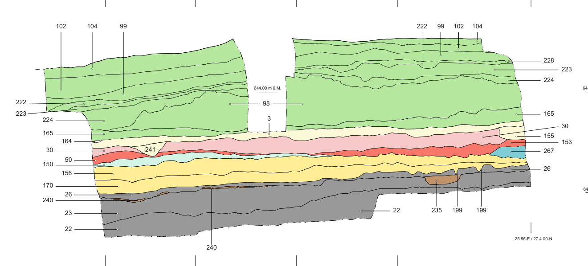

# Trimmis Profile 19 Drawing Comparison

## Result

The checksum-verified P19 source drawing contains all 26 contexts in the active
reference. Context 199 occurs in P19 but was absent from the published P19
matrix. The confirmed correction supersedes direct matrix relation `26 -> 170`
with `26 -> 199 -> 170`.

No additional chronological relation has been inferred automatically from the
drawing. The PDF exposes labels and vector geometry, but does not semantically
distinguish deposit boundaries, cuts, fills, and label leaders. Treating simple
vertical position or vector proximity as chronology would create unsupported
archaeological claims.

## Provenance layers

| Layer | Result |
|---|---:|
| Active reference contexts found in P19 | 26 / 26 |
| Label occurrences | 38 |
| Source-author-confirmed profile correction edges | 2 |
| Superseded published-matrix edges | 1 |
| Matrix relations awaiting drawing review | 27 |
| AI-proposed relations | 0 |



The image is a crop of `P19.pdf` from the Trimmis dataset, DOI
[10.5281/zenodo.4461075](https://doi.org/10.5281/zenodo.4461075), licensed CC BY
3.0. Its expected MD5 is `53ccf16a523e986ead69a30fc3f8dc24`.

## Reproduction

First acquire and checksum-verify the source package, then generate the
comparison:

```powershell
python scripts/qualify_trimmis.py .local-data/trimmis-source
python scripts/compare_trimmis_profile19_drawing.py .local-data/trimmis-source
```

The generator binds the output to the active reference, reviewed published
matrix, correction manifest, and source PDF checksum. It fails if context
coverage or the declared correction transformation differs.

- [Machine-readable comparison](../data/trimmis_profile19_drawing_comparison.json)
- [Extraction audit](TRIMMIS_PROFILE19_AUDIT.md)
- [Active corrected reference](../data/trimmis_profile19_reference.json)

## Review boundary

The 27 remaining relations require a qualified reviewer to inspect contact and
cut semantics in P19. Until then they retain matrix evidence only. Drawing
review must update a separate review artifact; it must not rewrite the source
extraction or silently promote proposed relations into the accepted graph.